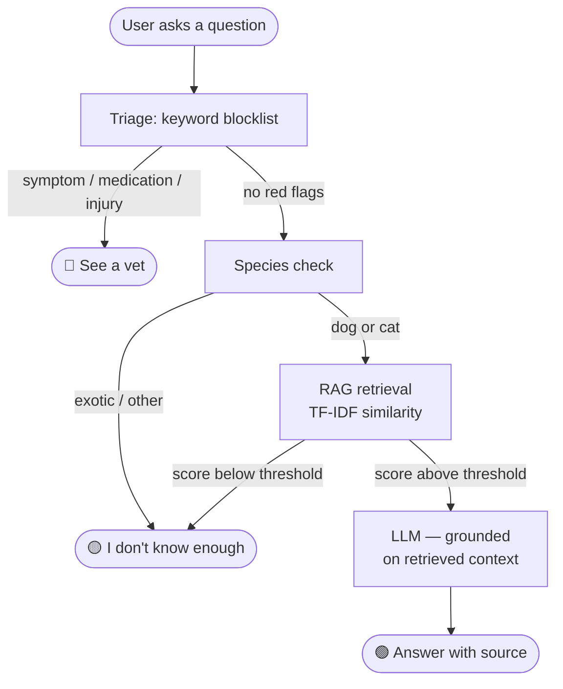
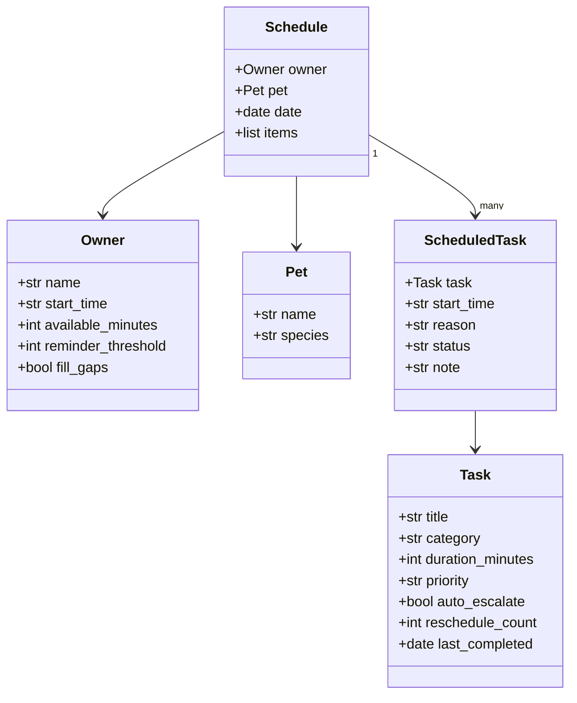

# PawPal+

A Streamlit app that helps pet owners plan daily care tasks and ask general pet care questions powered by a RAG-based AI assistant.

## Demo

> Watch a walkthrough of the scheduler and Ask PawPal assistant:

[Insert Loom link here]

**Example questions shown in the demo:**

- "How often should I brush my dog?" - green Answer badge with source
- "My cat has an upset stomach and vomits after eating" - green Answer badge with pumpkin puree advice
- "What plants are toxic for cats?" - green Answer badge with sourced list
- "What medication can I give my dog for pain?" - red See a vet badge (no API call made)

## Scenario

A busy pet owner needs help staying consistent with pet care. They want an assistant that can:

- Track pet care tasks (walks, feeding, meds, enrichment, grooming, etc.)
- Consider constraints (time available, priority, owner preferences)
- Produce a daily plan and explain why it chose that plan

Your job is to design the system first (UML), then implement the logic in Python, then connect it to the Streamlit UI.

## What you will build

Your final app should:

- Let a user enter basic owner + pet info
- Let a user add/edit tasks (duration + priority at minimum)
- Generate a daily schedule/plan based on constraints and priorities
- Display the plan clearly (and ideally explain the reasoning)
- Include tests for the most important scheduling behaviors

## System Architecture

### Ask PawPal — Decision Flow



### Scheduler — Data Model



## Getting started

### Setup

```bash
python -m venv .venv
source .venv/bin/activate  # Windows: .venv\Scripts\activate
pip install -r requirements.txt
```

### Suggested workflow

1. Read the scenario carefully and identify requirements and edge cases.
2. Draft a UML diagram (classes, attributes, methods, relationships).
3. Convert UML into Python class stubs (no logic yet).
4. Implement scheduling logic in small increments.
5. Add tests to verify key behaviors.
6. Connect your logic to the Streamlit UI in `app.py`.
7. Refine UML so it matches what you actually built.
